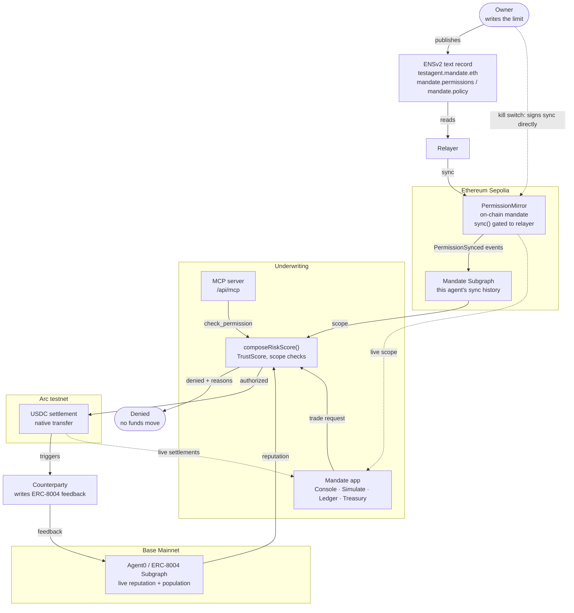

# Mandate

**An autonomous DeFi trading agent that cannot exceed the authority it was given —
because the limits live on-chain, not in the agent's own config.**

Live: **[mandate-rho.vercel.app](https://mandate-rho.vercel.app)** ·
MCP: **[`/api/mcp`](https://mandate-rho.vercel.app/api/mcp)** ·
Built for ETHOnline 2026 on Ethereum Sepolia and Arc testnet.

---

## The problem

You hire a bot to trade for you and tell it: *only Uniswap, max $10k per trade.*

Normally that rule lives in the bot's config file or its system prompt. But when the bot is
prompt-injected, hacked, or simply buggy, the rule and the rule-breaker are the same
process. Asking a compromised agent to respect its own config is asking a burglar to honour
the "no trespassing" sign.

This is not hypothetical. In 2026 a prompt-injected agent wallet lost roughly $150K twice;
another agent lost track of its own balance after a crash and sent 1000× its intended
transfer, losing about $250K; and MCP memory-poisoning attacks drained an estimated $45M
from a cluster of Solana trading-agent platforms.

## Prior art, and what Mandate adds

**[ERC-8004](https://eips.ethereum.org/EIPS/eip-8004)** gives agents on-chain identity and
reputation. **AgentScope** enforces spend limits on-chain via ERC-4337. Both are real
answers to half the problem: *enforcement*.

What neither does is feed **live reputation and risk into the enforcement decision itself**.
An agent's spend limit today is a static number; it does not tighten because the agent's
track record got worse, and it is not derived from a public record the agent cannot edit.

Mandate closes that: the mandate is published where anyone can read it, the agent cannot
change it, and the decision to allow a trade composes the published scope with live
reputation data at the moment of the trade.

## How it works



**The mandate is the unit, not the code.** Two agents with different published scopes are
enforced independently, from their own records.

## What is live right now

| | |
|---|---|
| Agent | `testagent.mandate.eth`, ERC-8004 agentId **10099** |
| Mandate | uniswap-v3, curve, aave-v3 · spot, lp · max $10,000/trade · $50,000/day |
| ENSv2 subname | `0x907779Ea…` subregistry, resolver `0x47199acb…` |
| PermissionMirror | [`0x6f19dd6f…`](https://sepolia.etherscan.io/address/0x6f19dd6f759fac8a19579ecdefb342009a21d9a7) — Sepolia block 11642041 |
| Mandate subgraph | [Studio v0.0.2](https://api.studio.thegraph.com/query/1758732/mandate-subgraph/v0.0.2), indexing live |
| MCP server | [`/api/mcp`](https://mandate-rho.vercel.app/api/mcp) — public, no key needed |
| Arc settlements | **5** settlements · **$1.60** total, across all three allowed protocols — [full history ↗](https://testnet.arcscan.app/address/0xa0062C5066cF0B34010D7c4E90F68E4287D083a8) |
| Reputation | 6 feedback entries on ERC-8004, written by a counterparty |

## Try it in two minutes, no wallet needed

```bash
git clone https://github.com/nisargpatel7042lva/mandate && cd mandate
npm install
cp .env.example .env      # add a Sepolia RPC URL and a Graph API key
```

**Ask the live MCP server whether a trade is allowed** — no setup at all:

```bash
curl -s https://mandate-rho.vercel.app/api/mcp \
  -H 'content-type: application/json' -H 'accept: application/json, text/event-stream' \
  -d '{"jsonrpc":"2.0","id":1,"method":"tools/call","params":{"name":"check_permission",
       "arguments":{"agentAddress":"0xa0062C5066cF0B34010D7c4E90F68E4287D083a8",
                    "protocol":"gmx-perp","amountUsdc":"5000"}}}'
```

```
authorized: false
reasons: ["Protocol gmx-perp not in allowlist (bitmask: 7)"]
```

**Read the whole agent back from chain:**

```bash
npm run read:identity     # ERC-8004 identity, reputation, and the ENS mandate
npm run underwrite -- uniswap-v3 8500   # ✅ authorized
npm run underwrite -- curve 12000       # ⛔ over the position limit
npm run underwrite -- gmx-perp 5000     # ⛔ protocol not in allowlist
```

**Onboard a brand-new agent** — one command, all real transactions (needs a funded Sepolia key):

```bash
npm run onboard -- demo 1000 5000 uniswap-v3
npm run underwrite -- uniswap-v3 500    # ✅
npm run underwrite -- uniswap-v3 2000   # ⛔ over the limit you just set
```

That last pair is the whole thesis: you set a limit, and the limit holds.

## Sponsor integrations

**ENS — ENSv2 on Sepolia.** The mandate *is* an ENSv2 record. `mandate.eth` is registered
through the v2 ETHRegistrar, `testagent.mandate.eth` exists in a per-name subregistry
deployed via VerifiableFactory, and the scope lives in `mandate.permissions` /
`mandate.policy` on a dedicated resolver deployed for that name. Nothing is hard-coded —
`npm run read:identity` resolves it all live. Getting here meant working out that ensjs
ships two incompatible Sepolia address sets, that ENSv2 names hold no children until a
subregistry is attached, and that its resolvers take `setText(string,string)` with no node.

**The Graph — two composed products.** Our own subgraph indexes `PermissionSynced` from
PermissionMirror on Sepolia. The Agent0/ERC-8004 subgraph supplies the live ERC-8004
population on Base Mainnet. `composeRiskScore()` combines them into one trust score with a
documented formula, and the whole thing is exposed as natural language over a public MCP
server. Reputation weights *distinct counterparties* over raw volume — the most active
indexed agent has 308,874 feedback entries from 2 addresses, which is a sybil pattern, not
trust.

**Arc / Circle — real USDC settlement.** Approved trades settle in USDC on Arc testnet.
Arc's native currency *is* USDC (18 decimals), so settlement is a value transfer with no
token contract and no approval — genuinely stablecoin-native. Settlement is **gated** on
the underwriting decision rather than logged beside it: a denied trade never reaches the
transfer. Each settlement record names the trust score, the specific checks that passed,
and the ENS record the scope came from. Outcomes are written back to ERC-8004 reputation.

**1inch — not submitted.** MandateGate as a custom SwapVM opcode was scoped as a stretch
goal and is not built. Enforcement today is off-chain, and we say so rather than implying
otherwise.

## Honest limitations

- **Enforcement is off-chain.** `composeRiskScore` runs server-side. The on-chain
  MandateGate opcode (which would make it unbypassable inside the swap) is not built.
  `PermissionMirror.isAuthorized()` is deployed and live, so the gate has a real call
  target — but the gate itself is future work.
- **Our subgraph does not index settlements.** It indexes permission syncs only; Arc
  settlements are verifiable on ArcScan but do not flow back into the subgraph yet.
- **Agent0 indexes Base Mainnet only.** Our Sepolia agent has no record there, so the
  ERC-8004 component of the trust score is reported as *unknown* and the weights
  renormalise. It is never silently scored as zero.
- **Onboarding is CLI, not UI.** One command, but a command.
- **Testnet throughout.** Real transactions on real chains; the funds have no value.

Full triage in [ISSUES.md](ISSUES.md); every external fact we verified, and how, in
[ASSUMPTIONS.md](ASSUMPTIONS.md).

## Repository

| | |
|---|---|
| `contracts/` | `PermissionMirror.sol` — the on-chain scope, relayer-gated |
| `scripts/` | Onboarding, ENS registration, settlement, underwriting — all runnable |
| `subgraph/` | Our Graph subgraph: schema, mappings, manifest |
| `mcp/`, `src/app/api/mcp/` | MCP server, standalone and deployed |
| `src/lib/` | `underwriting.ts` (the scoring formula), the two subgraph clients, Arc settlement |
| `src/app/` | Dashboard, agent overview, execute, treasury, blocked-transaction screens |
| [`ARCHITECTURE.md`](ARCHITECTURE.md) | Every deployed address, with the transaction that created it |
| [`HANDOFF.md`](HANDOFF.md) | Backend → UI interface contract |
| [`AI_USAGE.md`](AI_USAGE.md) | How AI was used, per session, per the ETHGlobal disclosure rules |

## Security note

The deployed app holds **no signing key**. Every write — onboarding, settlement, the kill
switch — is signed by the owner's own wallet or run from the CLI. An earlier version signed
kill-switch revocations server-side; an unauthenticated POST could then revoke the agent
from anywhere, which we hit for real during testing and removed. A product built on not
trusting an agent's good behaviour should not ask anyone to trust a server holding its
kill-switch key. See `I-002` in [ISSUES.md](ISSUES.md).
